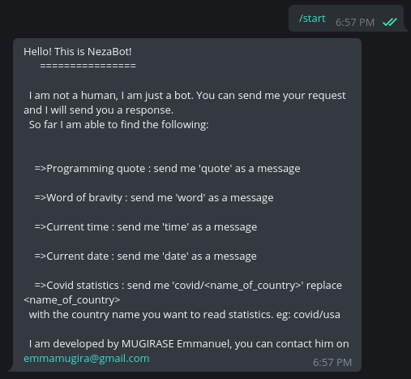
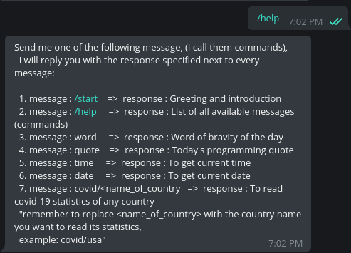
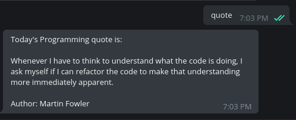
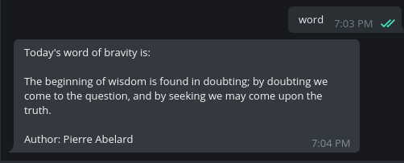
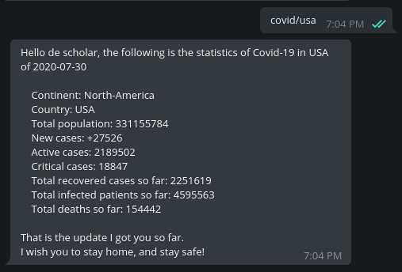
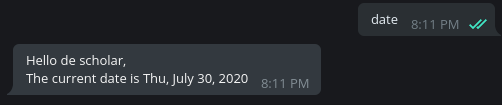
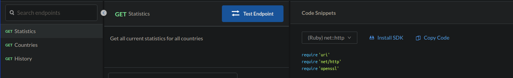
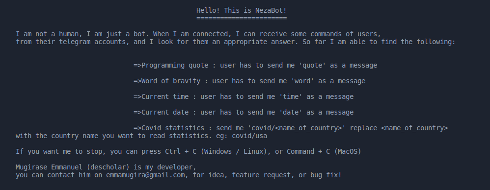

# Telegram-bot
    [](https://badge.fury.io/rb/telegram-bot-ruby)


## Description
`telegram-bot` is a chatbot built on top of [Telegram messenger](https://telegram.org/), this means you access it via [Telegram messenger](https://telegram.org/). It is able to help you with the following: 
- Giving you statistics of COVID-19 (Corona virus)
- Giving you word of bravity
- Telling you programming quote
- Telling the current time
- Telling you the current date

## Built with
* [Ruby](https://www.ruby-lang.org/en/)

## Screenshots
The following screenshots, show you the command and it's response (Command : header, response:screenshot)
|`/start`|`/help`|`quote`|
|-|-|-|
||||

|`word`|`covid/usa`|`date`|
|-|-|-|
||

## Deployment
- Go in your telegram account, and search `@neza_connect_bot` and hit `START` button or simply access it via this link [nezaBot](https://t.me/neza_connect_bot)

## Setup
To be able to use this bot follow the following steps

### Pre-requisites:
To be able to setup and run this project locally, you should have the following
1. [Ruby](https://www.ruby-lang.org/en/) installed on your computer
1. [Telegram account](https://telegram.org/)
1. Computer ready to run `terminal`, or `bash`

### Installation:
1. Run this command `git clone https://github.com/descholar-ceo/telegram-bot.git && cd telegram-bot` to clone and go in this repo
2. Create a file and name it `.env` in root directory of this project
3. Copy all of the fields which are in `.env.example` file from the root directory => in next steps I will show you how you are going to get the values of those fields 
4. Click [here](https://t.me/BotFather) or go to your telegram and search for `@BotFather` and send him this message: `/newbot` and follow instruction untill you get your bot api token which appears to look like this: `123456:ABC-DEF1234ghIkl-zyx57W2v1u123ew11`
5. Copy it and paste it on the first field in your `.env` file, (that field is `TELEGRAM_BOT_API_TOKEN=`)
6. Go to [RapidApi](https://rapidapi.com/api-sports/api/covid-193?endpoint=apiendpoint_dfb9e52d-bd90-48ec-a571-8b78610a736d), Signup or signin, and get your `COVID_API_HOST, COVID_API_KEY` and `COVID_API_URL` from there. When you see the window which looks like the following on the screenshot, scroll down on the rightmost window, and copy the values of `request["x-rapidapi-host"]`: paste this value on `COVID_API_HOST` in your `.env` file, and copy the value of `request["x-rapidapi-key"]` and paste it on `COVID_API_KEY` in your `.env` file, lastly for the `COVID_API_URL` use `https://covid-193.p.rapidapi.com/statistics`.


7. For the remaining fields use the following values:

```bash

    i.  WORD_OF_DAY_API=https://type.fit/api/quotes
    ii. PROGRAMMING_QUOTE_API=https://programming-quotes-api.herokuapp.com/quotes/lang/en

```

8. Run `bundle install` => To install all gems

### Start it
1. Run `bin/main.rb` => To start your `telegram-bot`. At this point you should see in your terminal a window which looks like the following on the screenshot:

2. Now your bot is live and is able to follow the commands you give it, go in your telegram messenger, and look for your bot, => the bot name you provided to the botfather on step 4.
3. Once you found it, click on it and hit `START` button, and start chatting with it, in last step, I will show you the list of commands the bot can understand so far
#### 12. List of messages (commands) currently this bot will respond to are:
```bash
  1. message : /start   =>  response : Greeting and introduction
  2. message : /help    =>  response : List of all available messages (commands)
  3. message : word     =>  response : Word of bravity of the day
  4. message : quote    =>  response : Today programming quote
  5. message : time     =>  response : To get current time
  6. message : date     =>  response : To get current date
  7. message : covid/<name_of_country   =>  response : To read covid-19 statistics of any country
  
  ===>remember to replace <name_of_country> with the country name you want to read its statistics,
  example: covid/usa
```
### Running tests locally
If all of the installations went well in the previous step, then you will be able to run tests
1. Initialize RSpec by running `rspec --init`
1. Run `rspec` => If you get some failures under `LookUp #read`, make sure that you have a stable internet connectivity

## Gems used

```bash

1. dotenv
2. json
3. net-http-persistent
4. rspec
5. rubocop
6. telegram-bot-ruby

```

## Contributions

There are two ways of contributing to this project:

1.  If you see something wrong or not working, please check [the issue tracker section](https://github.com/descholar-ceo/telegram-bot/issues ), if that problem you met is not in already opened issues then open the issue by clicking on `new issue` button.

2.  If you have a solution to that, and you are willing to work on it, follow the below steps to contribute:
    1.  Fork this repository
    1.  Clone it on your local computer by running `git clone https://github.com/your-username/telegram-bot.git` __Replace *your username* with the username you use on github__
    1.  Open the cloned repository which appears as a folder on your local computer with your favorite code editor
    1.  Create a separate branch off the *master branch*,
    1.  Write your codes which fix the issue you found
    1.  Commit and push the branch you created
    1.  Raise a pull request, comparing your new created branch with our original master branch [here](https://github.com/descholar-ceo/telegram-bot)

## Author (s)
### 1. MUGIRASE Emmanuel
* Github: [@descholar-ceo](https://github.com/descholar-ceo)
* Twitter: [@descholar3](https://twitter.com/descholar3)
* LinkedIn: [MUGIRASE Emmanuel](https://www.linkedin.com/in/mugirase-emmanuel-a90b49143)

## Show your support 
Give a ⭐️ if you like this project!

## Acknowledgment
* [Microverse](https://microvese.org): My great school
* [telegram-bot-ruby](https://github.com/atipugin/telegram-bot-ruby): It's a gem I used while creating this project
